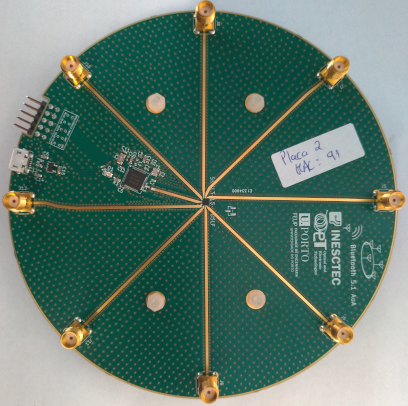
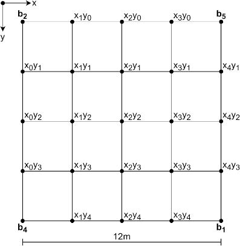
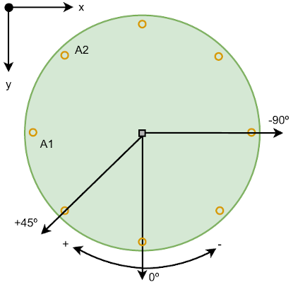
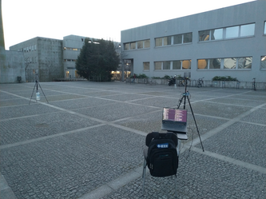
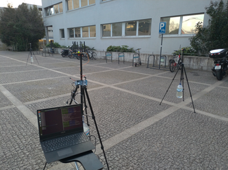
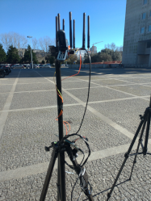
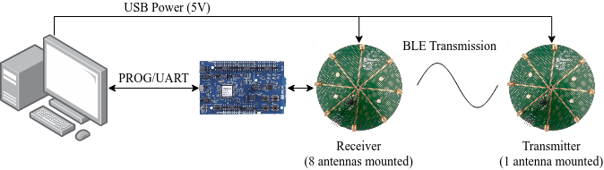

# A Dataset of Phase Samples using an 8-Element Uniform Circular Antenna Array and a Bluetooth Low Energy 5.1 Nordic nRF52811 Based Receiver

## Abstract

This dataset is a collection of phase samples retrieved from an in-house design for a Bluetooth Low Energy (BLE) 5.1 based receiver, using an 8-element Uniform Circular Array (UCA). The purpose of the dataset was the implementation of localization techniques based on the use of Angle-of-Arrival data, possible due to the BLE 5.1 Direction Finding (DF) features. Specifically, the phase differences of a Constant Tone Extension (CTE) read from the different antenna elements can be used to retrieve the AoA of a received packet.

For data collection, four transmitters (BLE beacons) were employed, and one receiver, in an outdoor area of 12x12 meters. For every 1 out of 21 positions on the map a total of 600 packets were retrieved. The resulting 21 CSV files contain the phase samples per packet (600 rows), per packet (111 columns). This data was collected in February 3rd 2022. 

## 8-Element Uniform Circular Array

The receiver device is based on a Nordic nRF52811 micro-controller, and contains a SP8T SKY13418-485LF RF switch (rated up to 6Ghz), which samples the 8-element UCA. The following figure illustrates the fabricated device.

|  |
|-|
| BLE 5.1 8-Element UCA Receiver (w/o antennas mounted) |

It is fabricated in a 1mm thick FR-4 substrate, with all anteannas being equally spaced. In order to avoid phase ambiguities, as AoA approaches require, the antennas are spaced by no less than half of the wavelength of the carrier. In the case of BLE, the carrier's central frequency is 2.4GHz, leading to $\lambda = 12.5cm$, meaning each neighbour antenna pair (e.g., $A1$ and $A2$) are spaced by $4.56cm < \lambda / 2$.

## Experimental Area And Reference Coordinates

The following figures illustrate the overhead view of the test area, and the receiver's relative 0º reference with respect to the map's coordinate system. 

|  |  | 
|-|-|
| Diagram of Test Area | Receiver Reference Orientation |

The data gathering was conducted in an outdoor area of 12x12 meters, with a rugged cement floor and no vertical obstructions. At each map position (i.e., $x_2y_2$ is the center of the map), three runs were performed that captured 200 packets in total. Therefore 600 packets per map position were gathered. The resulting 21 CSV files contain the phase samples per packet (600 rows), per packet (111 columns). This data was collected in February 3rd 2022. 

For every map position, the receiver was placed such that it's 0º orientation was always facing (i.e. aligned with) the y-axis of the map. We considered that the angles increase clockwise, and decrease counter-clockwise. That is, if the receiver is placed at $x_0y_2$, then a packet sent from $b_4$ will register an Angle-of-Arrival (AoA) of 0º, and one received from $b_4$ will register and AoA of $\pm180º$.

## Data Gathering Setup

The data was gathered by mounting the aformentioned 4 beacons and the 1 receiver, all mounted on equal tripods, approximately 1.3 meter off the ground. The following photographs illustrate the test area, and a detailed closeup of the receiver tripod which requires additional hardware for data gathering.

||||
|-|-|-| 
| Test Area Photos |  |  |

The following table summarizes the identification of each board, it's function, map position, and MAC address.

| Board ID | MAC    | Function         | Position  |
| -------- | ------ | ---------------- | --------- | 
| 1        | 0xffe0 | Transmitter (b1) | $x_4y_4$  |
| 2        | 0xff91 | Transmitter (b2) | $x_0y_0$  |
| 3        | ---    | Receiver         | Non-fixed |
| 4        | 0xffc0 | Transmitter (b3) | $x_0y_4$  |
| 5        | 0xffc1 | Transmitter (b4) | $x_4y_0$  |

The following figure illustrates the connection setup for retrieving the phase samples from each received packet into a laptop device, in order to produce the present dataset. While the beacon tripods are powered by 4 AA batteries (regulated to a 5V output), the recevier is powered by the laptop, which also connects to a Nordic nRF52840 Development Kit. While also used to program the devices, it is used as a UART brige during the experiments.

||
|-|
| Data Gathering Setup |

### CTE & Transmitter/Receiver Configuration

In order to retrieve the phase samples from a DF enabled BLE packet, the CTE configuration must be set. The configuration between the beacons and the receiver must be coherent (namely the CTE length and data rate). The switching and sampling configurations are applicable only to the receiver. For this dataset, the following configuration was employed:

- $160\mu s$ length
- $4\mu s$ switching period
- 500ns sample rate
- 1MBps Data Rate
- 4dBm TX power
- 8 samples per antenna captured (5 discarded)
- 3 samples are saved per antenna (one CSV file per map position)

Finally, the sampling pattern must be configured. We sampled the antennas of the UCA in a circular pattern (i.e, $A1$, $A2$, $A3$, etc) during the CTE length. We stored all phase samples of each packet in individual CSV rows (producing one file per map position), as explained in the following section.

## Data Set Format

The dataset contains a total of 21 files, each corresponding to one position of the map shown. The files are named accordingly to the map position. The data gathering continued until 600 packets were collected per position. The total of all raw collected data is in folder *data*. Each row CSV file of the csv file corresponds to the following information (the two example lines shown are the first two from *mapSmall_x0y1.csv*):

| Timestamp (s) | Beacon ID | $\theta_{A1_1}$ | $\theta_{A1_2}$ | $\theta_{A1_3}$ | $\theta_{A2_1}$ | $\theta_{A2_2}$ | $\theta_{A2_3}$ | ... |
| ---- | ---- | ---- | ---- | ---- | ---- | ---- | ---- | ---- |
| 0.092501 | 2 | -186 | -143 | -156 | -34 | -4 | -7 | ---- |
| 0.24852 | 5 | -119 | -69 |-27 |-139 |-80 |- 21 | ---- |
|  *More Data Rows* (Omitted) |
| 45.910376 | 5 | ---- | ---- | ---- | ---- | ---- | ---- | ---- |

After the Beacon ID, each set of 3 columns contains the phase sample of the Constant Tone Extension of the BLE packet. That is, $\theta_{A1_1}$ is the first sample for Antenna 1, *etc*. Following are the three samples for Antenna 2, 3, 4, *etc*. Once Antenna 8 is reached, the next three samples again correspond to Antenna 1. A total of 111 samples are retrieved, corresponding to ~4.625 sampling rotations of the board perimeter.

## Related Research Papers

- N. Paulino, L. M. Pessoa, A. Branquinho and E. Gonçalves, *Design and Experimental Evaluation of a Bluetooth 5.1 Antenna Array for Angle-of-Arrival Estimation*, 2022 13th International Symposium on Communication Systems, Networks and Digital Signal Processing (CSNDSP), 2022, pp. 625-630, doi: [10.1109/CSNDSP54353.2022.9907908](https://doi.org/10.1109/CSNDSP54353.2022.9907908).
- N. Paulino, L. M. Pessoa, *Self-Localization via Circular Bluetooth 5.1 Antenna Array Receiver*, 2022, IEEE Access (under review)
 
## Authors

Nuno Paulino - [ResearchGate](https://www.researchgate.net/profile/Nuno_Paulino2), [ORCID](https://orcid.org/0000-0001-5547-0323), [Google Scholar](https://scholar.google.com/citations?hl=pt-PT&authuser=2&user=cSGirLUAAAAJ)
